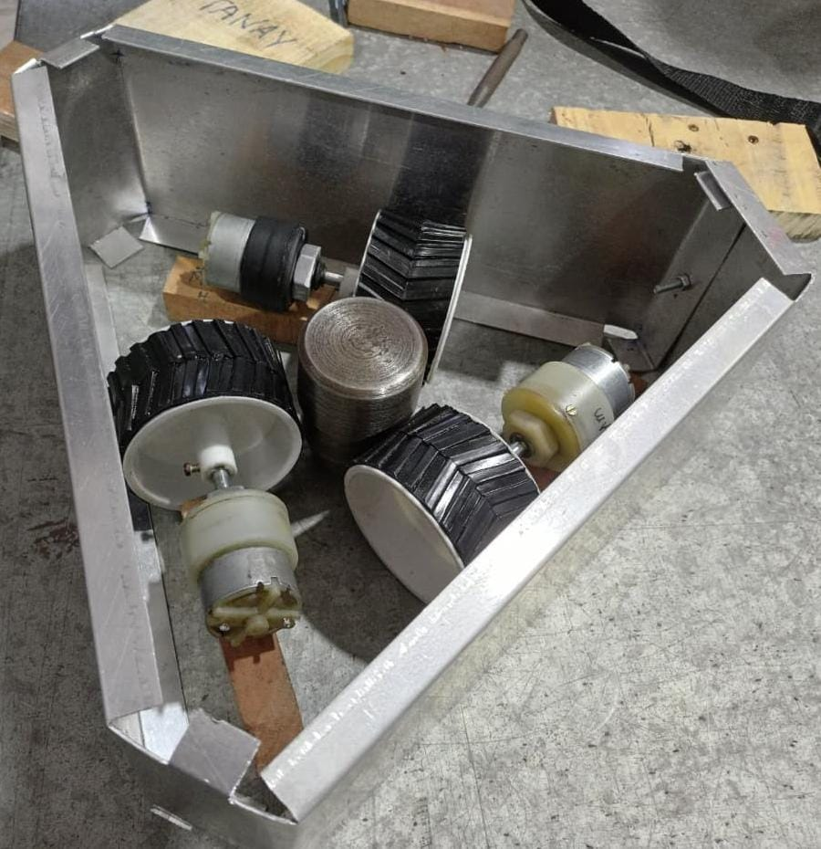
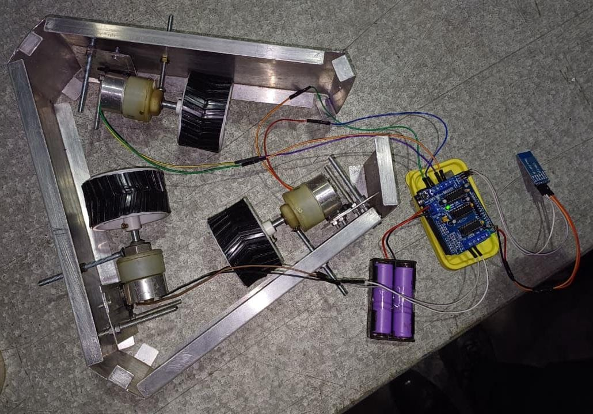

# Pole-Climbing-Robot
This is an Arduino-based robot designed for vertical mobility, utilising an L298N motor driver to power high-torque motors that grip and ascend poles. It features a Bluetooth interface for seamless wireless control, allowing users to remotely manage direction and speed for tasks like inspection or surveillance

# Project Overview- 
This project was built with the aim of creating a vertical mobility solution capable of ascending and descending cylindrical structures such as utility poles or pipes. The primary goal is to eliminate the risks associated with manual climbing for tasks like inspection, surveillance, or maintenance. By utilising a gripping mechanism powered by high-torque DC motors and a wireless control interface, this robot allows the operator to control the ascent safely from the ground.
The entire system is designed around a triangular gripping configuration where three motors are arranged at 120-degree intervals. This ensures equal pressure distribution on the pole, allowing the robot to maintain a firm grip while moving vertically.

  

<em> Initial Side View</em>

# Working Principle- 

The operation of the robot begins with the power supply. The system is powered by two 3.7V Lithium-Ion cells connected in series to provide a total of 7.4V. This power is routed through a 3-pin toggle switch, which acts as the main ON/OFF controller for the system, ensuring the robot can be safely powered down when not in use.
The central processing unit is the Arduino Uno R3 microcontroller, which interfaces with an HC-05 Bluetooth Module. The user connects to the robot via a smartphone application to send directional commands (Up, Down, Stop). When a command is received, the Arduino processes the signal and instructs the L298N Motor Driver. This driver manages the three 150RPM DC motors simultaneously. The low RPM and high torque of these motors are crucial; they allow the robot to overcome gravity and the friction of the pole without slipping.
Ascent: All three motors rotate in a forward direction, driving the wheels up the pole surface.
Descent: The polarity is reversed by the driver, allowing controlled descent.
Holding: When stopped, the high gear ratio of the motors acts as a brake to hold the robot in position.

  

<em> ITop View after wie Connections</em>

### Components Used

| Component | Quantity | Description |
| :--- | :--- | :--- |
| **Arduino Uno R3** | 1 | Microcontroller for processing commands. |
| **L298N Motor Driver** | 1 | Controls the high-torque DC motors. |
| **HC-05 Bluetooth Module** | 1 | Enables wireless communication. |
| **150RPM DC Motors** | 3 | Provides high torque for gripping and climbing. |
| **Li-Ion Cells (3.7V)** | 2 | Power source (Series connection for 7.4V). |
| **3-Pin Toggle Switch** | 1 | Master power control for the robot. |

  

<em>Circuit Diagram </em>

